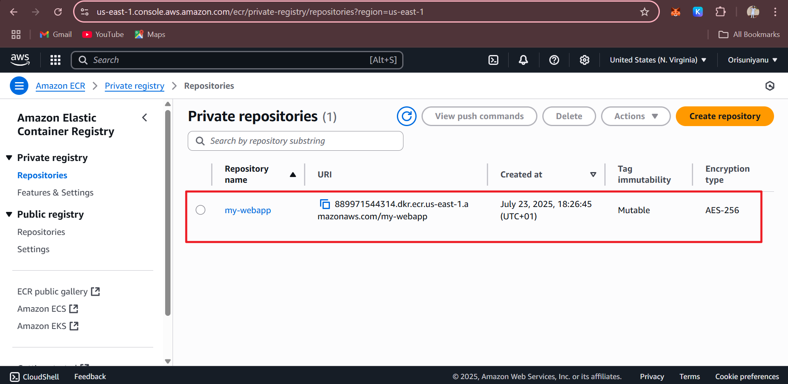

# Mini Project: Hosting a Dynamic Web App om AWS with Terraform Module, Docker, Amazon ECR, and ECS.

## Purpose:

In this mini project, I will use Terraform to create a modular infrastructure for hosting a dynamic web application on Amazon ECS (Elastic Container Service). This project involves containerizing the web app using Docker, pushing the image to Amazon ECR (Elastic Container Register), and deploying the app on ECS.

## Objectives:

- **Terraform Module Creation:** Create Terraform modules for modular infrastructure provisioning.
- **Dockerization:** Containerize a dynamic web application using Docker.
- **Amazon ECR Configuration:** Configure Terraform to create an Amazon ECR repository for storing Docker images.
- **Amazon ECS Deployment:** Use Terraform to provision an ECS cluster and deploy the Dockerized web app.

## Project Tasks

# Task 1: Dockerization of Web App

1. I created a small dynamic web application using Flask technology.

- first I installed python3 on my server

``` bash
sudo yum update -y
sudo yum install python3 -y
python3 --version
```

- I also installed pip3

``` bash
sudo python3 get-pip.py
```

then i created these directories using this Flask structure

``` bash
flask-webapp/
│
├── app.py
├── requirements.txt
├── static/
│   ├── style.css
│   └── images/
├── templates/
│   └── index.html
└── README.md
```


a.  My web app structure.


``` bash
#index.html

<!DOCTYPE html>
<html>
<head>
    <title>SANDRA BluDive</title>
    <link rel="stylesheet" href="{{ url_for('static', filename='style.css') }}">
</head>
<body>
    <h1>Welcome to My Flask Website!</h1>
    <p>This website is created for my final assessment.
       This will serve as the first website.</p>


    


</body>
</html>
```

b. Then I also create app.py that will server my web app after I make sure I have installed python3 and flask.


``` bash
#app.py

from flask import Flask, render_template

app = Flask(__name__)

@app.route('/')
def home():
    return render_template('index.html')


if __name__ == "__main__":
    app.run(host="0.0.0.0", port=5000, debug=True)
```


c. Then I ran the python command to test my website.

``` bash
python3 apy.py
```


this is the website outcome


d. Then I check the logs how the triffic on my website


2. Then I create Dockerfile for the flask appication I built.

a. Dockerfile

``` bash
#Dockerfile

FROM python

COPY . .

RUN pip3 install flask

CMD ["python3", "app.py"]
```

b. Dockerfile Explaination: 
- `FROM python` - This is the base image i want to use for my application. 
- `COPY . .` - This is to copy the files in my current directory 
- `RUN pip3 install flask` - Here I want it to install flask for me because my application is using flask. - `CMD ["python3", "app.py"]` - This is the command that will be ran to keep my application alive.

c. After creating the Dockerfile I run this command to build the container

``` bash
docker build -t flask-app .
```


# Dockerization of Web App

## 5. Docker Images

d. **Command explaination:** 
- `docker build` - This is the command to build the container from docker manifest file. 
- `-t flask-app` - This is to tag the image I want to build and give it a name.


e. After building the image I ran this command to start the image and turn it to container

``` bash
docker run -d -p 5000:5000 flask-app
```


I had to check the docker images


f. **Command explaination:** 
- `docker run` - This command is to start the image to container. 
- `-d `- Is to run the container in a background mood. - `-p 5000:5000` - This is the port I want to give my website and also the port I want to map to my host.
- `flask-app` - Is the image I want to start.


3. Then I test my webapp inside the container if is serving my website.


Then I further test the container by going inside the container to test the WebApp.

``` bash
docker exec -it 989bc991ec92 bash
```


# Task 2: Terraform Module for Amazon ECR

1. I first created a new directory which I named `terraform-ecs-webapp` and navigate inside the directory.

``` bash
mkdir terraform-ecs-webapp
```

2. Then inside the directory I create another directory this time I named it `modules/ecr`.

``` bash
mkdir -p modules/ecr
cd modules/ecr
```

3. At the root repository of the project I write the module I want to use for `ecr` and `ecs`.

``` bash
vi main.tf
```

``` bash
# main.tf

module "ecr" {
  source           = "./modules/ecr"
  repository_name  = "webapp"
}

module "ecs" {
  source              = "./modules/ecs"
  ecr_repository_url  = module.ecr.repository_url
    cluster_name = "terraform-cluster"
    service_name = "terraform-service"
}
```

4. Then I move to `modules/ecr` and create another main.tf and variable.tf file there.

``` bash
# modules/ecr/main.tf

resource "aws_ecr_repository" "this" {
  name                 = var.repository_name
  image_tag_mutability = "MUTABLE"

  lifecycle_policy {
    policy = <<EOF
{
  "rules": [
    {
      "rulePriority": 1,
      "description": "Keep only the last 10 images",
      "selection": {
        "tagStatus": "any",
        "countType": "imageCountMoreThan",
        "countNumber": 10
      },
      "action": {
        "type": "expire"
      }
    }
  ]
}
EOF
  }
}
```

``` bash
# modules/ecr/variables.tf
variable "repository_name" {
  description = "Name of the ECR repository"
  type        = string
}
```

5. Then I move out from the ecr directory I find my back ecs directory `modules/ecs/`, and also create main.tf and variables.tf files there.

``` bash
# modules/ecs/main.tf

provider "aws" {
  region = "us-east-1"
}

module "vpc" {
  source = "terraform-aws-modules/vpc/aws"

  name = "ecs-vpc"
  cidr = "10.0.0.0/16"

  azs             = ["us-east-1a", "us-east-1b"]
  public_subnets  = ["10.0.1.0/24", "10.0.2.0/24"]

  enable_dns_hostnames = true
  enable_dns_support   = true
}

module "ecr" {
  source           = "./modules/ecr"
  repository_name  = "webapp"
}

module "ecs" {
  source              = "./modules/ecs"
  ecr_repository_url  = module.ecr.repository_url

  cluster_name        = "terraform-cluster"
  task_family         = "webapp-task"
  container_port      = 80
  cpu                 = "256"
  memory              = "512"

  service_name        = "terraform-service"
  desired_count       = 1

  subnets             = module.vpc.public_subnets
  security_groups     = [module.vpc.default_security_group_id]
}
```

``` bash
# modules/ecs/variables.tf

variable "cluster_name" {
  type        = string
  description = "Name of the ECS Cluster"
}

variable "task_family" {
  type        = string
  description = "Family name of the task definition"
}

variable "cpu" {
  type        = string
  default     = "256"
  description = "CPU units"
}

variable "memory" {
  type        = string
  default     = "512"
  description = "Memory (MB)"
}

variable "container_port" {
  type        = number
  default     = 80
}

variable "execution_role_arn" {
  type        = string
  description = "ARN of the task execution role"
}

variable "task_role_arn" {
  type        = string
  description = "ARN of the task role"
}

variable "ecr_repository_url" {
  type        = string
  description = "ECR repository image URL"
}

variable "service_name" {
  type        = string
  description = "ECS Service name"
}

variable "desired_count" {
  type        = number
  default     = 1
}

variable "subnets" {
  type        = list(string)
  description = "List of subnet IDs for the service"
}

variable "security_groups" {
  type        = list(string)
  description = "List of security group IDs for the service"
}
```

After that I also create `terraform.tfvars` which I don't want to expose to the public for security reasons.

# Task 3: Configuration

After I have define all the neccessary files needed the I execute the following command/process.

1. I initialized the terraform to download all the neccesary module needed

``` bash
terraform init
```


2. Since I want to push the docker image I built before to Amazon ECR so I have to apply for `module/ecr` first and push the image before I apply for other files. Before that I ran below command to check if my script is correctly defined.

``` bash
terraform validate
```

And is successful


``` bash
terraform apply -target=module.ecr
```


3. Then I went to the aws portal to check if the repository has been created successfully.





4. Then I was able to get my ECR URL link, which I use to push the image to my repository.
After that I login to my ECR docker.

``` bash
aws ecr get-login-password --region us-east-1 | docker login --username AWS --password-stdin <ECR_URL>
```

Then I tag the image and push it

``` bash
docker tag flask-app:latest <ECR_URL>:latest

docker push <ECR_URL>:latest
```


5. After that I also check it on the aws portal to comfirm it.


6. After I have successful pushed the image to the register then I ran the full terrraform apply.


``` bash
terraform apply
```


7. Then I run the following command to get my public ip.

``` bash
aws ecs list-tasks --cluster webapp-cluster     # To get my task arns
```

After I get my public ip then I use it to acess my website.

![15. Last Outcome]